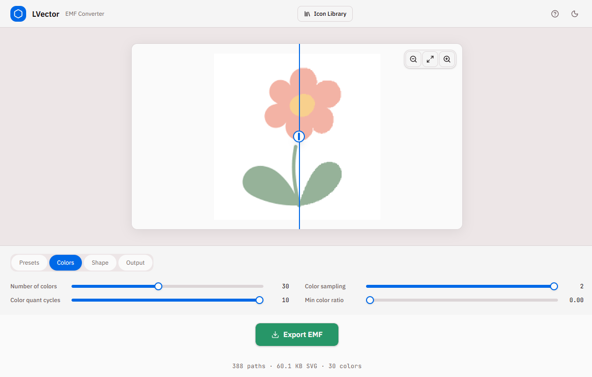

# LVector

A browser-based raster-to-vector converter that traces bitmap images to SVG and exports pixel-perfect EMF (Enhanced Metafile) files. Built with Next.js 16, imagetracerjs, and a custom SVG-to-EMF binary encoder.

## What It Does



1. **Upload** any raster image (PNG, JPG, GIF, BMP, WEBP)
2. **Trace** it to vector SVG using imagetracerjs with configurable settings
3. **Preview** the actual EMF output in real-time (not the raw SVG — you see exactly what gets exported)
4. **Export** a standards-compliant EMF file that faithfully reproduces the SVG

## Architecture

```
User uploads image
       │
       ▼
┌──────────────────────┐
│  Next.js API Route   │  /api/convert (POST)
│  sharp → RGBA pixels │
│  imagetracerjs → SVG │
└──────────┬───────────┘
           │ SVG string
           ▼
┌──────────────────────┐
│  Client-side EMF     │  lib/conversion/svg-to-emf.ts
│  Encoder (binary)    │  Parses SVG → flattens curves → writes EMF records
└──────────┬───────────┘
           │ Uint8Array (EMF binary)
           ▼
┌──────────────────────┐
│  EMF Canvas Renderer │  lib/conversion/emf-renderer.ts
│  (preview only)      │  Reads EMF binary → draws on HTML Canvas
└──────────────────────┘
```

## Key Components

### `lib/conversion/svg-to-emf.ts` — SVG-to-EMF Encoder

The core converter. Parses SVG and produces a valid EMF binary file.

**SVG parsing capabilities:**
- All path commands: `M`, `L`, `H`, `V`, `C`, `S`, `Q`, `T`, `A`, `Z` (absolute and relative)
- Adaptive Bézier flattening with configurable flatness (0.15)
- Correct smooth cubic (`S`) and smooth quadratic (`T`) control point reflection
- Arc command (`A`) with proper center parameterization
- SVG shape elements: `<rect>`, `<circle>`, `<ellipse>`, `<line>`, `<polygon>`, `<polyline>`
- Rounded rectangles via arc segments
- Full circles/ellipses via two 180° arcs (avoids degenerate start==end)
- `style` attribute parsing (e.g. `style="fill:red"`)
- Property inheritance through `<g>` groups
- Chained `transform` attributes: `matrix`, `translate`, `scale`, `rotate(cx,cy)`, `skewX`, `skewY`
- `opacity`, `fill-opacity`, `stroke-opacity` support
- ViewBox coordinate mapping
- Named CSS colors (red, blue, green, etc.) and `rgb()` notation

**EMF output:**
- Correct `EMR_CREATEPEN` record layout (color at offset 24 per LOGPEN spec)
- Correct `EMR_CREATEBRUSHINDIRECT` with explicit `lbHatch` field
- Correct `EMR_MOVETOEX`/`EMR_LINETO` at 16 bytes
- Real pen + real brush per shape (no `PS_NULL`/`BS_NULL` — many viewers don't handle them)
- Single `EMR_POLYGON` call for fill+stroke shapes (imagetracerjs pattern)
- Degenerate paths (< 3 points) rendered as 1px dots instead of being dropped

**Exported functions:**
- `buildEmfFromSvg(svgString)` → `Uint8Array` — core conversion
- `exportSvgAsEmf(svgString, filename)` — triggers browser download
- `svgToEmfBlob(svgString)` → `Blob` — returns blob for further use

### `lib/conversion/emf-renderer.ts` — EMF Preview Renderer

A mini EMF player that reads the binary and draws onto an HTML `<canvas>`. This is what the preview uses — you see the actual EMF output, not the raw SVG.

Parses `EMR_CREATEPEN`, `EMR_CREATEBRUSHINDIRECT`, `EMR_SELECTOBJECT`, `EMR_DELETEOBJECT` to track GDI state, then renders `EMR_POLYGON`, `EMR_POLYLINE`, `EMR_MOVETOEX`/`EMR_LINETO`.

### `app/api/convert/route.ts` — Server-side Tracing API

Accepts a base64-encoded image + conversion options, uses `sharp` to decode to RGBA pixels, then `imagetracerjs` to trace to SVG.

### `components/convert/` — UI Components

| Component | Purpose |
|---|---|
| `convert-view.tsx` | Main view orchestrator — file upload, conversion flow, export |
| `preview-canvas.tsx` | Split-view preview: original image vs EMF canvas output |
| `comparison-slider.tsx` | Draggable slider comparing left/right panels |
| `settings-panel.tsx` | Conversion settings (colors, thresholds, scale, etc.) |
| `action-bar.tsx` | Upload/Export/Reset buttons |
| `header-bar.tsx` | Navigation header |
| `stats-bar.tsx` | Path count, file size, color count display |

### `components/library/library-view.tsx` — Icon Library

Browse and select from 100+ Lucide icons to convert. Each icon is rendered as an SVG and fed through the same pipeline.

## Conversion Settings

All imagetracerjs options are exposed through the settings panel:

| Setting | Default | Description |
|---|---|---|
| `numberofcolors` | 16 | Number of output colors (2-64) |
| `colorsampling` | 2 | Color sampling method (0=disabled, 1=random, 2=deterministic) |
| `colorquantcycles` | 3 | Color quantization refinement cycles |
| `mincolorratio` | 0 | Minimum color ratio threshold |
| `ltres` | 1 | Linear approximation threshold (lower = more detail) |
| `qtres` | 1 | Quadratic spline threshold (lower = more detail) |
| `blurradius` | 0 | Pre-processing blur radius (0=off) |
| `blurdelta` | 20 | Blur delta threshold |
| `pathomit` | 8 | Minimum path length to keep (lower = keep small details) |
| `linefilter` | false | Enable line filtering |
| `scale` | 1 | Output scale factor |
| `strokewidth` | 1 | Stroke width for output paths |
| `roundcoords` | 1 | Decimal places for coordinates |
| `layering` | 0 | Layering mode (0=sequential, 1=stacked) |
| `viewbox` | false | Use viewBox instead of fixed width/height |

Settings auto-reconvert with 500ms debounce — the EMF preview updates in real-time.

## Test Suite

### `lib/conversion/test-emf.ts` — Core Pipeline Tests (29 assertions)

Run: `npx tsx lib/conversion/test-emf.ts`

| Test | Validates |
|---|---|
| `right_arrow` | Triangle: 4 closed points, blue pen/brush, 100x100 device |
| `circle_plus_icon` | Two shapes (outer + inner icon) — both must render |
| `viewbox_scaling` | ViewBox 100→200: coordinates doubled correctly |
| `quadratic_bezier` | Q curve flattening with correct start/end |

### `lib/conversion/test-harddrive.ts` — Icon & Detail Tests (7 assertions)

Run: `npx tsx lib/conversion/test-harddrive.ts`

| Test | Validates |
|---|---|
| `small_details` | 4 shapes including 1x1 pixel rect survives |
| `harddrive_imagetracer` | Hard drive icon: body, line, and two dots all captured |

Tests are excluded from Next.js builds via `tsconfig.json`.

## Development

```bash
# Install dependencies
npm install

# Development server
npm run dev

# Production build
npm run build

# Run tests
npx tsx lib/conversion/test-emf.ts
npx tsx lib/conversion/test-harddrive.ts
```

## Tech Stack

- **Next.js 16** (App Router, Turbopack)
- **React 19**
- **imagetracerjs** — raster-to-SVG tracing
- **sharp** — server-side image decoding
- **lucide-react** — icon library for the library view
- **shadcn/ui** — UI component primitives
- **Tailwind CSS 4** — styling
- **jsdom** + **tsx** — test infrastructure (dev only)

## EMF Format Notes

The EMF files produced are valid Enhanced Metafiles per the Windows SDK `wingdi.h` specification:

- `MM_TEXT` mapping mode (1 pixel = 1 unit)
- `WINDING` polygon fill mode
- `R2_COPYPEN` raster operation
- Binary EMF description string ("LVector\0EMF Vector Export\0")
- Frame coordinates in 0.01mm units (derived from 96 DPI)
- Compatible with Windows GDI32 `PlayEnhMetaFile()`, Office applications, and EMF viewers
